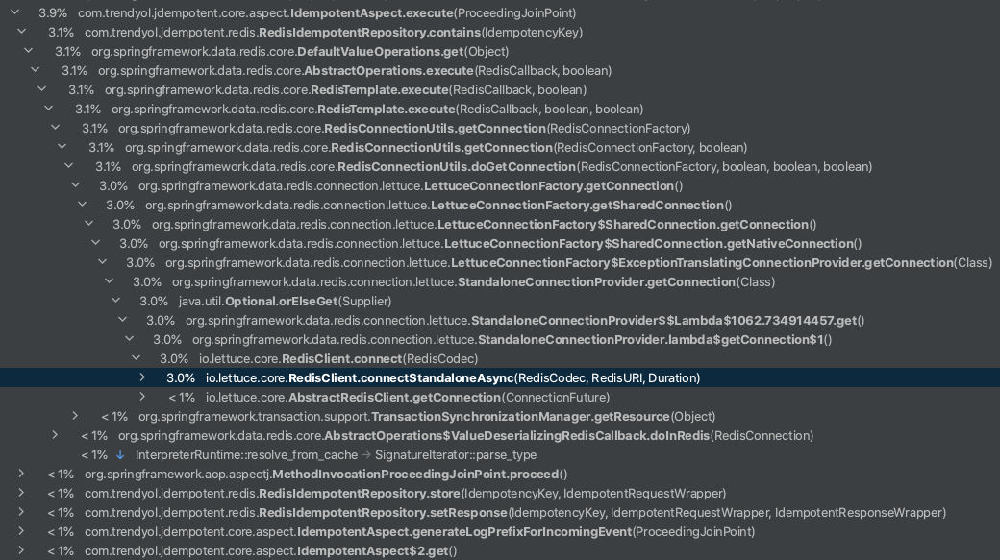

# Jdempotent

[](https://github.com/Trendyol/Jdempotent/actions/workflows/jdempotent-spring-boot-redis-starter.yml)

<p align="center">
  
</p>

# Goal of this Jdempotent-spring-boot-starter

Make your listener or etc idempotent easily

# Usage

1 - First of all you need add dependency to pom.xml

```xml
    <dependency>
        <groupId>com.trendyol</groupId>
        <artifactId>Jdempotent-spring-boot-redis-starter</artifactId>
        <version>1.0.4</version>
    </dependency>
```

2 - You should add `@IdempotentResource` annotation to that you want to make idempotent resource, listener etc.

```java
@IdempotentResource(cachePrefix = "WelcomingListener")
@KafkaListener(topics = "trendyol.mail.welcome", groupId = "group_id")
public void consumeMessage(@IdempotentRequestPayload String emailAdress) {
    SendEmailRequest request = SendEmailRequest.builder()
            .email(message)
            .subject(subject)
            .build();

    try {
        mailSenderService.sendMail(request);
    } catch (MessagingException e) {
        logger.error("MailSenderService.sendEmail() throw exception {} event: {} ", e, emailAdress);

        // Throwing any exception is enough to delete from redis. When successful, it will not be deleted from redis and will be idempotent.
        throw new RetryIdempotentRequestException(e);
    }
}
```
3 - If you want custom error case, you should implement `ErrorConditionalCallback` like a following example

```java
@Component
public class AspectConditionalCallback implements ErrorConditionalCallback {

    @Override
    public boolean onErrorCondition(Object response) {
        return response == IdempotentStateEnum.ERROR;
    }
    
    public RuntimeException onErrorCustomException() {
        return new RuntimeException("Status cannot be error");
    }

}
```

4 - Let's make redis configuration.

```yaml
jdempotent:
  enable: true
  cache:
    redis:
      database: 1
      password: "password"
      sentinelHostList: 192.168.0.1,192.168.0.2,192.168.0.3
      sentinelPort: "26379"
      sentinelMasterName: "admin"
      expirationTimeHour: 2
      dialTimeoutSecond: 3
      readTimeoutSecond: 3
      writeTimeoutSecond: 3
      maxRetryCount: 3
      expireTimeoutHour: 3
```

Also you can disable jdempotent any time for example you don't have circut breaker but your redis down etc.
You can wish disable jdempotent with following configuration.

```yaml
  enable: false
```

```java
@SpringBootApplication(
      exclude = { RedisAutoConfiguration.class, RedisRepositoriesAutoConfiguration.class }
)
```

### Performance

As it is shown in the following image, the most cpu consuming part of jdempotent is getting a redis connection so we don't need to worry performance related issues.

<p align="center">
  
</p>

### Docs
[Jdempotent Medium Article](https://medium.com/trendyol-tech/an-idempotency-library-jdempotent-5cd2cd0b76ff) <br/>
[Jdempotent-core Javadoc](https://memojja.github.io/jdempotent-core/index.html) <br/>
[Jdempotent-spring-boot-redis-starter Javadoc](https://memojja.github.io/jdempotent-spring-boot-redis-starter/index.html)

### TODOS
- [ ] Disable request&response configgi
- [ ] Write examples under the examples folders
- [ ] Support multiple request paylaod as a paramater
- [ ] Ignore a throwing custom exception like ErrorConditionalCallback
- [ ] Support multiple datasources
