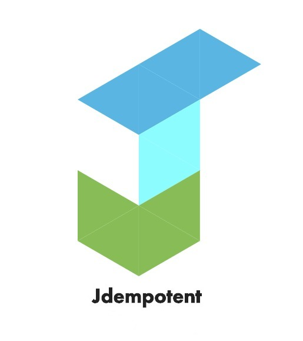

# Jdempotent

[](https://github.com/Trendyol/Jdempotent/actions/workflows/jdempotent-spring-boot-redis-starter.yml)

<p align="center">
  
</p>

# Goal of this Jdempotent-spring-boot-starter

Make your endpoints idempotent easily

# Usage

1. First of all, you need to add a dependency to pom.xml

For Redis:

```xml
<dependency>
    <groupId>com.trendyol</groupId>
    <artifactId>Jdempotent-spring-boot-redis-starter</artifactId>
    <version>1.1.0</version>
</dependency>
```
For Couchbase:

```xml
<dependency>
    <groupId>com.trendyol</groupId>
    <artifactId>Jdempotent-spring-boot-couchbase-starter</artifactId>
    <version>1.1.0</version>
</dependency>
```

2. You should add `@IdempotentResource` annotation to the method that you want to make idempotent resource, listener etc.

```java
@IdempotentResource(cachePrefix = "WelcomingListener")
@KafkaListener(topics = "trendyol.mail.welcome", groupId = "group_id")
public void consumeMessage(@IdempotentRequestPayload String emailAdress) {
    SendEmailRequest request = SendEmailRequest.builder()
            .email(message)
            .subject(subject)
            .build();

    try {
        mailSenderService.sendMail(request);
    } catch (MessagingException e) {
        logger.error("MailSenderService.sendEmail() throw exception {} event: {} ", e, emailAdress);

        // Throwing any exception is enough to delete from redis. When successful, it will not be deleted from redis and will be idempotent.
        throw new RetryIdempotentRequestException(e);
    }
}
```

If want that idempotencyId in your payload. Put `@JdempotentId` annotation that places the generated idempotency identifier into annotated field.
Can be thought of as @Id annotation in jpa

For example:

```java
public class IdempotentPaylaod {
   @JdempotentId
   private String jdempotentId;
   private Object data;
}
```

You might want to handle the name of the field differently to ensure idempotency. Just use @JdempotentProperty annotation needs to get the field name differently and generate the hash

```java
public class IdempotentPaylaod {
   @JdempotentProperty("userId")
   private String customerId;
   private Object data;
}
```


3. If you want to handle a custom error case, you need to implement `ErrorConditionalCallback` like the following example:

```java
@Component
public class AspectConditionalCallback implements ErrorConditionalCallback {

    @Override
    public boolean onErrorCondition(Object response) {
        return response == IdempotentStateEnum.ERROR;
    }
    
    public RuntimeException onErrorCustomException() {
        return new RuntimeException("Status cannot be error");
    }

}
```

4. Let's make the configuration:

For redis configuration:

```yaml
jdempotent:
  enable: true
  cache:
    redis:
      database: 1
      password: "password"
      sentinelHostList: 192.168.0.1,192.168.0.2,192.168.0.3
      sentinelPort: "26379"
      sentinelMasterName: "admin"
      expirationTimeHour: 2
      dialTimeoutSecond: 3
      readTimeoutSecond: 3
      writeTimeoutSecond: 3
      maxRetryCount: 3
      expireTimeoutHour: 3
```

For couchbase configuration:

```yaml
jdempotent:
  enable: true
  cryptography:
    algorithm: MD5
  cache:
    couchbase:
      connection-string: XXXXXXXX
      password: XXXXXXXX
      username: XXXXXXXX
      bucket-name: XXXXXXXX
      connect-timeout: 100000
      query-timeout: 20000
      kv-timeout: 3000
```

Please note that you can disable Jdempotent easily if you need to. 
For example, assume that you don't have a circut breaker and your Redis is down.
In that case, you can disable Jdempotent with the following configuration:


```yaml
  enable: false
```

```java
@SpringBootApplication(
      exclude = { RedisAutoConfiguration.class, RedisRepositoriesAutoConfiguration.class }
)
```

## Performance

As it is shown in the following image, the most cpu consuming part of Jdempotent is getting a Redis connection so we don't need to worry performance related issues.

<p align="center">
  
</p>

# Docs

[Jdempotent Medium Article](https://medium.com/trendyol-tech/an-idempotency-library-jdempotent-5cd2cd0b76ff) <br/>
[Jdempotent-core Javadoc](https://memojja.github.io/jdempotent-core/index.html) <br/>
[Jdempotent-spring-boot-redis-starter Javadoc](https://memojja.github.io/jdempotent-spring-boot-redis-starter/index.html)

## Support

[memojja's twitter](https://twitter.com/memojja) <br/>

## Licence

[MIT Licence](https://opensource.org/licenses/MIT) <br/>

## Contributing

1. Fork it ( https://github.com/Trendyol/Jdempotent/fork )
2. Create your feature branch (git checkout -b my-new-feature)
3. Commit your changes (git commit -am 'Add some feature')
4. Push to the branch (git push origin my-new-feature)
5. Create a new Pull Request

## Contributors

- [memojja](https://github.com/memojja) Mehmet ARI - creator, maintainer
